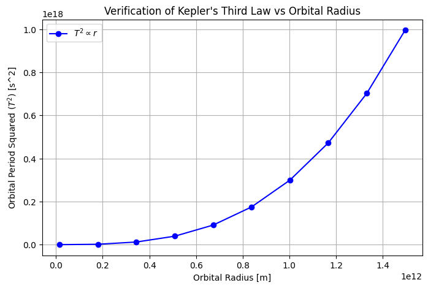

# Problem 1

## Derivation of Kepler's Third Law

### Step 1: Gravitational and Centripetal Forces

Newton's Law of Gravitation:

$$
F_g = \frac{G M m}{r^2}
$$

Centripetal force for circular motion:  

$$
F_c = m \frac{v^2}{r}
$$

Equating $$F_g = F_c$$ :

$$
\frac{G M m}{r^2} = m \frac{v^2}{r}
$$

Canceling $$m$$ :

$$
\frac{G M}{r^2} = \frac{v^2}{r}
$$

Multiplying by $$r$$ :

$$
v^2 = \frac{G M}{r}
$$

### Step 2: Expressing in Terms of Orbital Period  

Using  $$v = \frac{2\pi r}{T}$$ :

$$\left( \frac{2\pi r}{T} \right)^2 = \frac{G M}{r}$$

$$\frac{4\pi^2 r^2}{T^2} = \frac{G M}{r}$$

Multiplying by $$r$$ : 

$$
4\pi^2 r^3 = G M T^2
$$

### Step 3: Final Relation  

$$
T^2 = \frac{4\pi^2}{G M} r^3
$$

Thus,

$$
T^2 \propto r^3
$$

## Implications of Kepler’s Third Law in Astronomy  

Kepler’s Third Law $$T^2 \propto r^3$$ plays a key role in understanding celestial mechanics.

### 1. Calculating Planetary Masses  
Using $$M = \frac{4\pi^2 r^3}{G T^2}$$ we can determine the mass of a central body (e.g., the Sun, exoplanet host stars, or giant planets) by observing orbiting objects.

### 2. Measuring Distances  
If an object's orbital period is known, its distance can be calculated. This was historically used to estimate Solar System dimensions.  

### 3. Exoplanet Detection  
Kepler’s Law aids in finding exoplanets via transit and radial velocity methods, helping estimate their orbits and masses.

### 4. Orbital Stability & Dark Matter  
- Systems following $$T^2 \propto r^3$$ are gravitationally stable.  
- Deviations suggest additional planets or unseen mass (e.g., dark matter in galaxies).

### Conclusion
Kepler’s Third Law is a fundamental tool in astronomy, linking planetary motion to gravitational interactions across the universe.

## Real-World Examples of Kepler’s Third Law

### 1. The Moon's Orbit Around Earth
- **Orbital Period:** Approximately 27.3 days.
- **Average Distance:** Roughly 384,400 km.
- **Application:**
Using the formula $$M_{\text{Earth}} = \frac{4\pi^2 r^3}{G T^2},$$ astronomers can calculate Earth's mass. Measurements from the Moon’s motion yield a value consistent with independent estimates, demonstrating the law's accuracy in our own celestial backyard.

### 2. Planetary Orbits in the Solar System
- **General Relationship:**  
  Every planet's orbital period $$T$$ and average distance $$r$$ from the Sun obey  
$$T^2 \propto r^3.$$
- **Example: Earth and Mars**
  - **Earth:** 1 year period at 1 astronomical unit (AU).
  - **Mars:** Approximately 1.88 years period at about 1.52 AU.
- **Implication:**  
  These proportionalities allow astronomers to derive the mass of the Sun and to predict planetary positions accurately.

### Conclusion
Observations from the Moon's orbit to the trajectories of planets validate Kepler’s Third Law, proving it essential for determining celestial masses and distances, and enhancing our understanding of gravitational dynamics in the Solar System.

## Kepler's Third Law and Elliptical Orbits

Kepler’s Third Law also applies to elliptical orbits, with the square of the orbital period $$T$$ still being proportional to the cube of the semi-major axis $$a$$:

$$
T^2 \propto a^3
$$

For elliptical orbits, the semi-major axis (the average distance between the orbiting body and the central body) governs the orbital period.

### 1. Application to Celestial Bodies

- **Moons and Planets:** The law applies to moons orbiting planets, such as Earth’s Moon, and to exoplanets orbiting stars.
- **Binary Star Systems:** For binary stars, the combined mass and semi-major axis determine the orbital period.
- **Complex Systems:** In multi-body systems, Kepler’s Law can still be used, but gravitational interactions and perturbations need to be considered.

### 2. Relativity and Modifications

For systems with high masses or velocities, such as near black holes, General Relativity may modify Kepler’s Third Law to account for relativistic effects.

### Conclusion

Kepler’s Third Law is a fundamental tool for understanding orbital mechanics, extending from planetary orbits to more complex celestial systems.

## Here’s a simulation to verify Kepler’s Third Law for circular orbits.

## Conclusion on general

Kepler's Third Law helps calculate orbital periods based on the central mass and orbital radius. By comparing planets orbiting different central masses (like the Sun and hypothetical stars), we see that a larger central mass results in shorter orbital periods. This relationship is key to understanding planetary and exoplanetary systems. The log-log plot highlights how central mass and orbital radius influence orbital periods, with smaller masses leading to longer periods for a given radius. This law is a powerful tool for astronomers to estimate orbital periods in various celestial systems.
