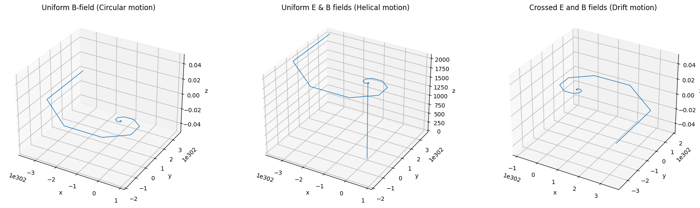
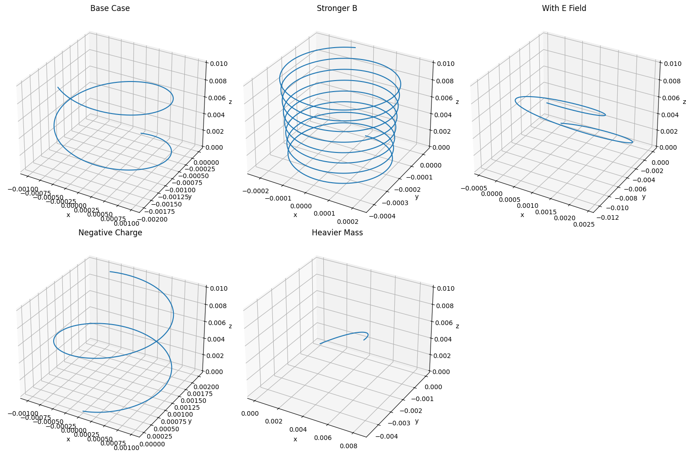
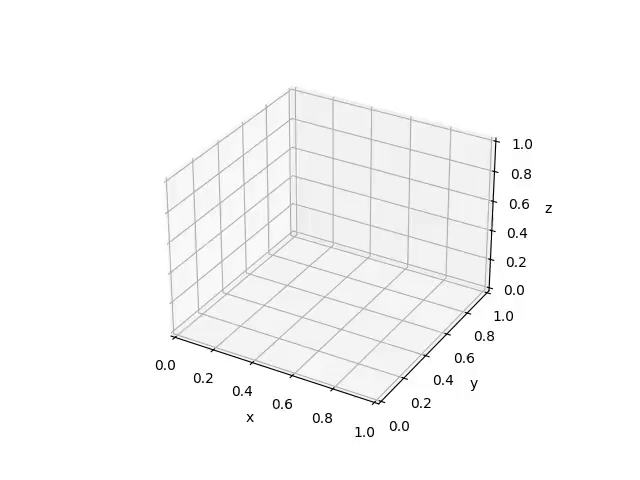

# Problem 1

## **1. Systems Where the Lorentz Force Is Crucial**

Here are some key systems and technologies that rely heavily on the Lorentz force:

---

### **A. Particle Accelerators**

- **How it works**: Charged particles (e.g., protons, electrons) are accelerated using electric fields and steered using magnetic fields.
- **Lorentz Force Role**:
  - $\vec{F} = q\vec{E}$: Electric fields provide energy to accelerate particles.
  - $\vec{F} = q\vec{v} \times \vec{B}$: Magnetic fields curve particle trajectories, guiding them in circular or helical paths.
- **Example**: The Large Hadron Collider (LHC) uses powerful magnets to steer protons at near-light speeds.

---

### **B. Mass Spectrometers**

- **How it works**: Separate ions based on their mass-to-charge ratio.
- **Lorentz Force Role**:
  - Ions pass through magnetic or electric fields and are deflected based on their velocity and charge.
  - The trajectory curvature gives information about their mass.
- **Key Equation**: $$r = \frac{mv}{qB}$$ (radius of curvature of the particle path).
- **Application**: Identifying chemical compounds or isotopes.

---

### **C. Plasma Confinement (e.g., Tokamaks)**

- **How it works**: Magnetic fields are used to trap and control high-energy plasma in fusion reactors.
- **Lorentz Force Role**:
  - Magnetic fields confine the charged plasma particles into toroidal (donut-shaped) paths to prevent them from touching reactor walls.
- **Importance**: Maintains high-temperature, high-density conditions necessary for nuclear fusion.

---

### **D. Cathode Ray Tubes (CRTs)**

- **How it works**: Beams of electrons are steered by magnetic or electric fields to form images.
- **Lorentz Force Role**:
  - Electric fields control acceleration.
  - Magnetic fields control the direction of electron beams.

---

### **E. Astrophysics (e.g., Solar Wind Interaction with Magnetic Fields)**

- **How it works**: Solar particles interact with planetary magnetic fields (like Earth's magnetosphere).
- **Lorentz Force Role**:
  - Governs the motion of cosmic rays and solar wind particles.
  - Explains phenomena like auroras and magnetic storms.

---

## **2. Relevance of Electric ($\vec{E}$) and Magnetic ($\vec{B}$) Fields**

---

### **Electric Fields ($\vec{E}$)**

- **Direct acceleration**: Cause particles to gain kinetic energy in the direction of the field.
- **Straight-line influence**: Change particle speed without necessarily curving their path (in uniform fields).
- **Used for**:
  - Injecting energy into particles.
  - Initiating motion from rest.

---

### **Magnetic Fields ($\vec{B}$)**

- **Directional control**: Do not change particle speed, only direction.
- **Cause circular/helical motion**: Because the magnetic force is always perpendicular to velocity.
- **Used for**:
  - Steering and focusing beams (e.g., in accelerators and mass spectrometers).
  - Confining particles (e.g., in fusion reactors).

---

### **Combined Effects**

The full Lorentz force $$\vec{F} = q\vec{E} + q\vec{v} \times \vec{B}$$ allows for rich dynamics:

- **Drift motion**: In crossed $\vec{E}$ and $\vec{B}$ fields, particles can drift perpendicular to both fields.
- **Cyclotron motion**: In pure $\vec{B}$, charged particles spiral.
- **Helical motion**: In combined $\vec{E}$ and $\vec{B}$, particles can follow spiral paths along field lines.

## Parameter Exploration

## Lorentz Force Equation

The Lorentz force is given by:

$$
\vec{F} = q (\vec{E} + \vec{v} \times \vec{B})
$$

Where:
- $q$ = charge of the particle
- $m$ = mass of the particle
- $\vec{E}$ = electric field
- $\vec{B}$ = magnetic field
- $\vec{v}$ = initial velocity

---

### **1. Field Strengths: $\vec{E}$ and $\vec{B}$**

- **Electric Field ($\vec{E}$)**:
  - Directly adds acceleration to the particle: $\vec{a}_E = \frac{q\vec{E}}{m}$
  - Leads to **linear acceleration** in the direction of $\vec{E}$.

- **Magnetic Field ($\vec{B}$)**:
  - Causes **circular or helical motion** if perpendicular to velocity.
  - Radius of circular path: $r = \frac{mv}{|q||\vec{B}|}$
  - Frequency of rotation (cyclotron frequency): $f = \frac{|q||\vec{B}|}{2\pi m}$

> **Explore**: 
- Varying $B$ increases rotation frequency and tightens the spiral or circle.
- Varying $E$ stretches the trajectory linearly in $\vec{E}$'s direction.

---

### **2. Initial Velocity $\vec{v}$**

- If $\vec{v} \parallel \vec{B}$: Particle moves straight along $\vec{B}$.
- If $\vec{v} \perp \vec{B}$: Pure circular motion.
- If $\vec{v}$ has both components: **Helical motion**.

> **Explore**: 
- Adjusting $\vec{v}$'s direction changes the shape from a straight line → circle → helix.

---

### **3. Charge $q$ and Mass $m$**

- **Charge $q$**:
  - Direction of force reverses with sign of $q$.
  - Larger $|q|$ increases force magnitude.

- **Mass $m$**:
  - Affects how easily the particle accelerates (inertia).
  - Larger $m$ → larger radius, slower acceleration.

> **Explore**: 
- Positive vs. negative charge → opposite rotation direction.
- Heavier particles spiral more slowly and with larger radius.

---
### Simulating the Trajectory of a Charged Particle in Electric and Magnetic Fields: Effects of Field Strength, Charge, Mass, and Initial Velocity

## Physical Phenomena: Larmor Radius and Drift Velocity

## Larmor Radius (Cyclotron Radius)**

The **Larmor radius** (also known as the **cyclotron radius**) is the radius of the circular orbit that a charged particle follows when it moves perpendicular to a magnetic field. This motion is due to the magnetic force acting on the particle.

### Formula:
The Larmor radius, $r_L$, is given by the formula:

$$
r_L = \frac{mv}{|q|B}
$$

Where:
- $m$ = mass of the particle
- $v$ = speed of the particle (perpendicular to $ \vec{B} $)
- $q$ = charge of the particle
- $B$ = magnetic field strength

### Physical Interpretation:
- A larger magnetic field strength ($B$) leads to a smaller radius of curvature, meaning the particle's path tightens.
- A larger particle mass ($m$) or velocity ($v$) leads to a larger radius, meaning the particle follows a wider circular path.
- The Larmor radius defines the **size of the helical or circular motion** the particle undergoes when perpendicular to the magnetic field.

---

## **2. Drift Velocity**

When a charged particle moves through a medium (like a plasma or a conductor), in addition to the circular motion caused by the magnetic field, there is often a **drift velocity**. This drift occurs when an electric field ($\vec{E}$) is present, causing the charged particles to move in the direction of the electric field.

### Formula:
The drift velocity, $\vec{v}_D$, is given by the relation:

$$
\vec{v}_D = \frac{\vec{E}}{B}
$$

Where:
- $\vec{E}$ = electric field
- $B$ = magnetic field strength

### Physical Interpretation:
- The drift velocity is the net velocity of the charged particle due to the combined effects of electric and magnetic fields.
- The drift velocity is perpendicular to the magnetic field and aligned with the electric field.
- For example, in a **crossed field configuration** (where $\vec{E}$ and $\vec{B}$ are perpendicular), the charged particle moves in a **spiral path**, but the drift velocity shifts the entire path in the direction of the electric field.
---

## **Relationship Between Larmor Radius and Drift Velocity**

- In the presence of both electric and magnetic fields, the particle will have a helical trajectory with:
  - A **circular motion** governed by the Larmor radius in the plane perpendicular to the magnetic field.
  - A **drift velocity** that causes the entire trajectory to move in the direction of the electric field.

