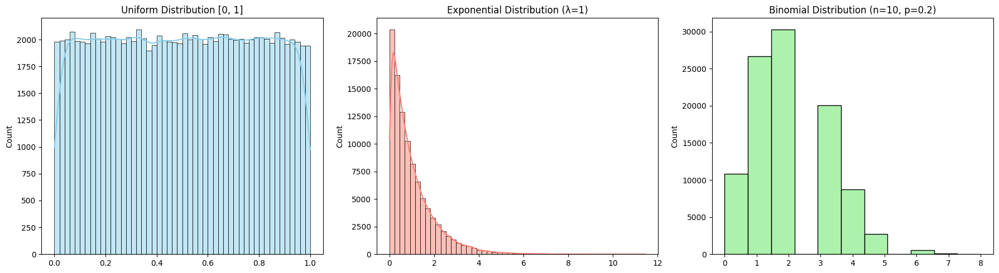
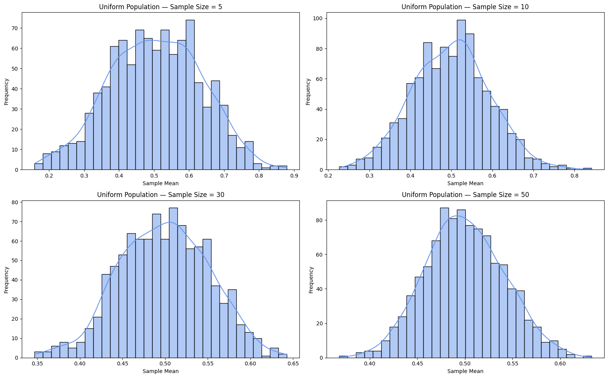
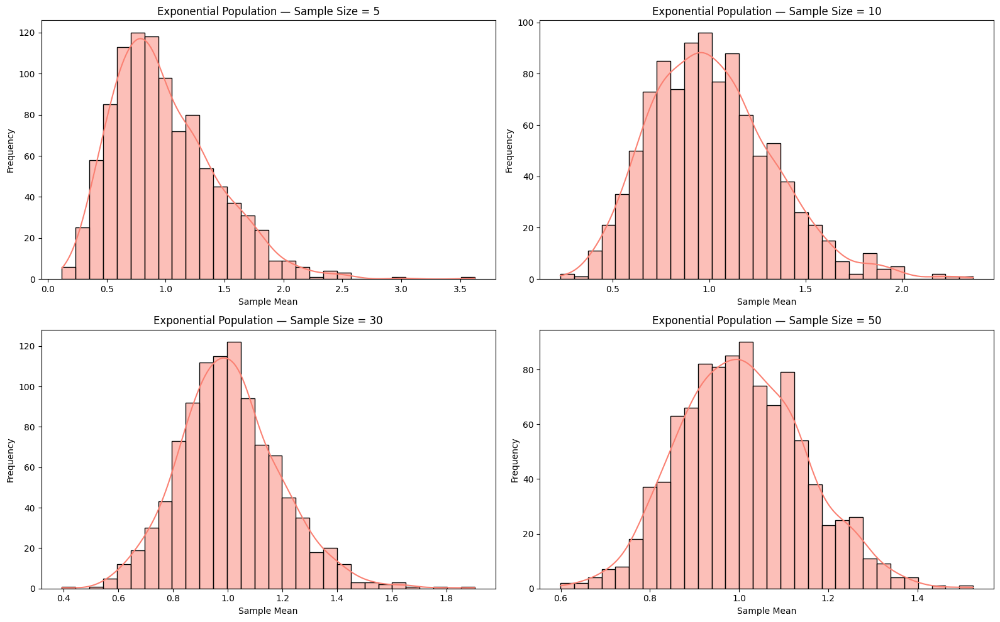
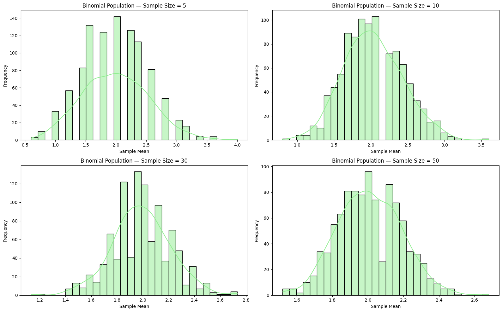
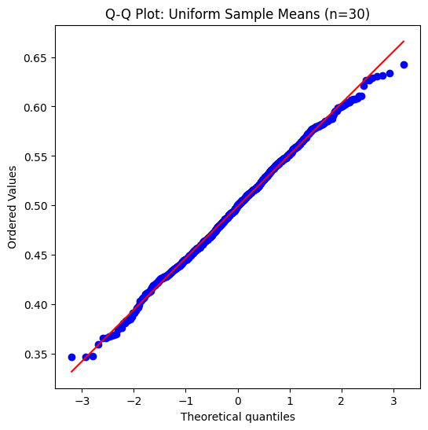
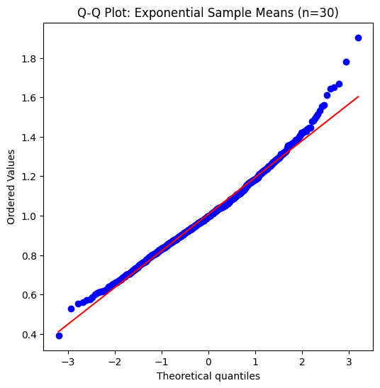
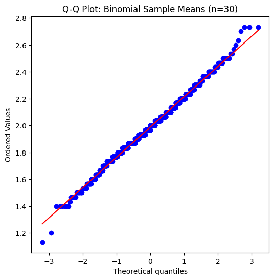
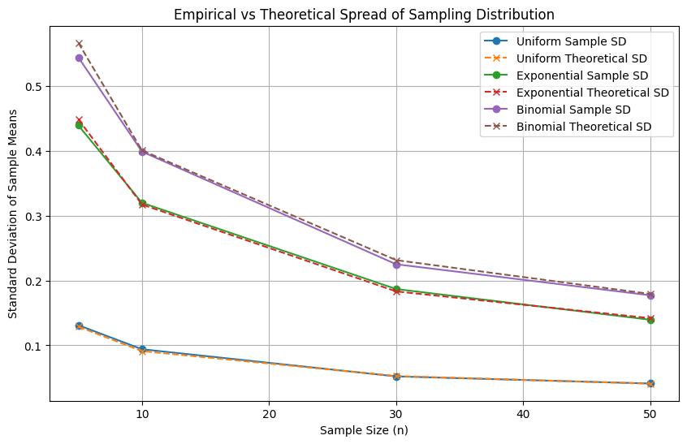

# Problem 1

Simulating Population Distributions

We will generate three different populations:

1. **Uniform Distribution**: Values are evenly distributed between 0 and 1.

2. **Exponential Distribution**: A right-skewed distribution often used to model waiting times.

3. **Binomial Distribution**: A discrete distribution representing the number of successes in a fixed number of trials.

Each population will contain 100,000 data points to ensure a robust simulation.
We will visualize the distributions to highlight how their shapes differ from a normal distribution.

---

For each population distribution (Uniform, Exponential, Binomial), we:
- Draw 1000 random samples of various sizes: n = 5, 10, 30, 50
- Calculate the mean of each sample
- Plot histograms of the resulting sampling distributions of the sample mean

This process allows us to observe how the sampling distribution of the mean becomes increasingly normal as sample size increases — a key idea behind the Central Limit Theorem.

---

---

---

## Parameter Exploration

1. **Convergence Rate to Normality**
   
   Different population shapes (Uniform, Exponential, Binomial) require different sample sizes before their sampling distributions appear normal.
   
   We will use visual tools (histograms, Q-Q plots) and statistical tests to observe this.

2. **Variance and Spread**
   
   The spread (standard deviation) of the sampling distribution decreases as sample size increases.

   It is theoretically $\sigma_{\bar{x}} = \frac{\sigma}{\sqrt{n}}$, where $\sigma$ is the population standard deviation.
   
   We will empirically compare this formula with observed sampling distribution spreads.

---

---

### Normality Tests and Spread Visualization

## Practical Applications

The Central Limit Theorem (CLT) is not just a theoretical curiosity — it underpins many real-world applications:

1. **Estimating Population Parameters:**

    When conducting surveys or polls, it's often impractical to measure an entire population.
    
    By taking random samples, the CLT ensures the sample mean is a reliable estimator for the population mean.
   
    This justifies the use of confidence intervals and hypothesis testing in statistics.

2. **Quality Control in Manufacturing:**
    
    Factories monitor product quality by sampling items from production lines.
    
    The CLT guarantees that averages of samples reflect the overall process, even if individual measurements vary.
    
    This helps detect deviations or defects early without exhaustive inspection.

3. **Financial Modeling and Risk Assessment:**
   
    Financial analysts model asset returns or portfolio risks using averages of returns.
    
    The CLT allows modeling these aggregated returns as approximately normal, even if individual returns are not.
    
    This supports techniques like Value at Risk (VaR) and portfolio optimization.

In all these cases, the CLT provides a mathematical foundation for making inferences about large populations or complex systems from manageable samples.

## Conclusion

The Central Limit Theorem is a fundamental principle in statistics that explains why sample means tend to follow a normal distribution, regardless of the original population distribution, as sample size increases. Through simulations with uniform, exponential, and binomial populations, we observed:

- Sampling distributions of the mean become more bell-shaped and symmetric as sample size grows.
- The rate of convergence to normality depends on the shape of the original distribution, with more skewed populations requiring larger samples.
- The spread of the sampling distribution decreases proportionally to the inverse square root of the sample size, matching theoretical expectations.
- These properties underpin practical applications in fields like survey sampling, quality control, and financial modeling, enabling reliable inference and decision-making from limited data.

Overall, the CLT provides a powerful justification for using normal distribution assumptions in many real-world statistical analyses.
