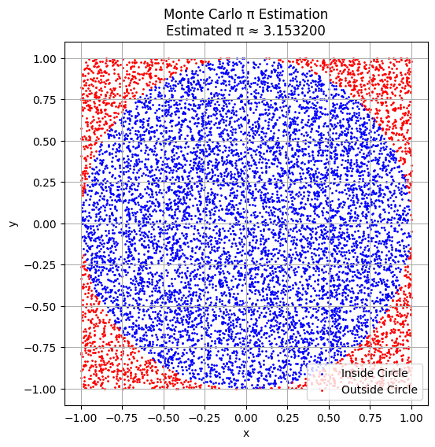
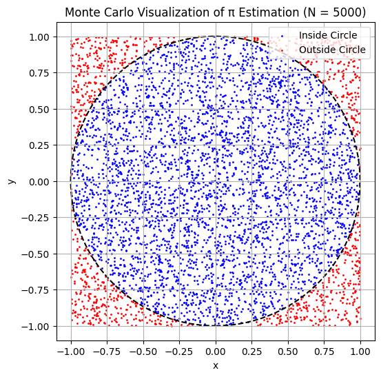
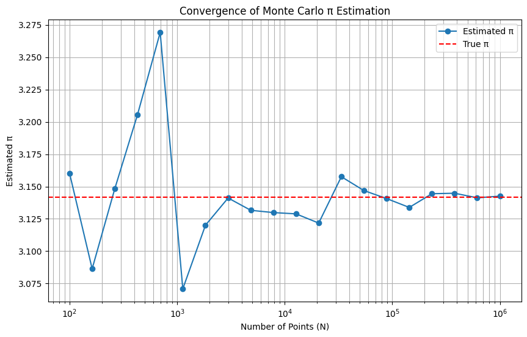
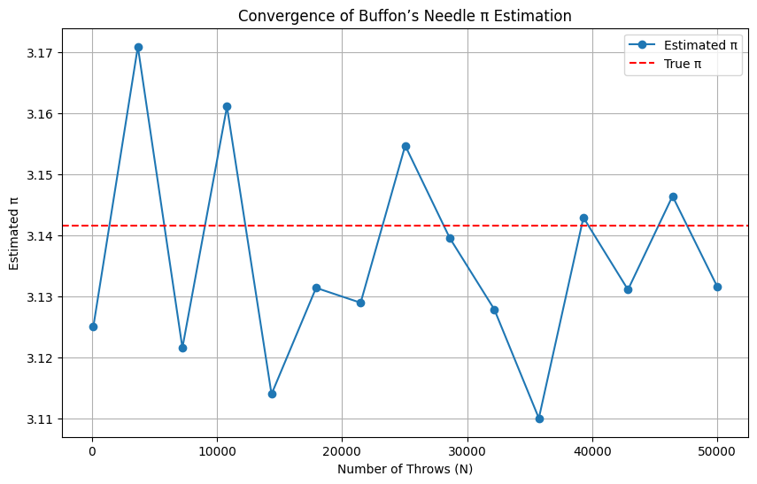
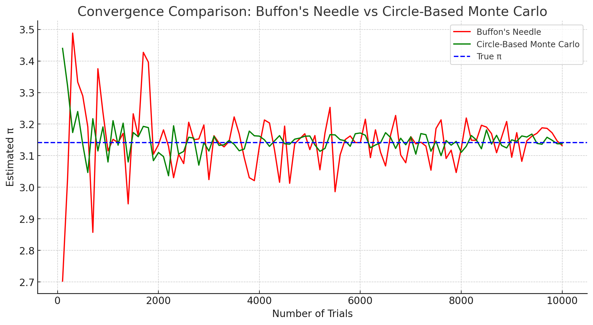

# Problem 2

# Estimating π Using Monte Carlo Methods  
---
## Theoretical Foundation

To estimate π using randomness, we consider a geometric probability setup.

- Draw a **square** of side length 2, centered at the origin. This square spans from $-1$ to $1$ along both the x and y axes.
- Inside this square, draw a **unit circle** (radius $r = 1$) also centered at the origin.

Now we generate random points $(x, y)$, where $x, y \in [-1, 1]$, such that the points are uniformly distributed across the square.

### Geometric Areas:

- **Area of the square**:  
$$A_{\text{square}} = 2 \times 2 = 4$$

- **Area of the unit circle**:  
$$A_{\text{circle}} = \pi \times r^2 = \pi \times 1^2 = \pi$$

The **probability** that a randomly chosen point lands **inside the circle** is given by the ratio of the areas:

$$
P(\text{inside circle}) = \frac{A_{\text{circle}}}{A_{\text{square}}} = \frac{\pi}{4}
$$

Therefore, if we generate a large number of random points and count how many fall inside the circle, we expect:

$$
\frac{\text{Points inside circle}}{\text{Total points}} \approx \frac{\pi}{4}
$$

---

## Derivation of the Estimation Formula

Given the theoretical relationship:

$$
\frac{\text{Points inside circle}}{\text{Total points}} \approx \frac{\pi}{4}
$$

We can solve for $\pi$ to get an estimate:

$$
\pi \approx 4 \times \frac{\text{Points inside circle}}{\text{Total points}}
$$

This is the core **Monte Carlo estimation formula** for π.

---

## How to Check if a Point is Inside the Circle

For any randomly generated point $(x, y)$, it lies **inside the unit circle** if:

$$
x^2 + y^2 \leq 1
$$

Thus, for each point, compute $x^2 + y^2$.  
If the result is less than or equal to 1, the point is counted as **inside the circle**.

---
## Monte Carlo Simulation to Estimate π

In this simulation, we:

1. Generate $N$ random points $(x, y)$ inside a square from $[-1, 1] \times [-1, 1]$.
2. Count how many of them fall inside the unit circle using the condition $x^2 + y^2 \leq 1$.
3. Estimate π using the formula:

$$
\pi \approx 4 \times \frac{\text{Points inside circle}}{\text{Total points}}
$$

## Visualization of Monte Carlo Points

To visually understand how the Monte Carlo method estimates π:

- We plot all randomly generated points $(x, y)$ inside the square.
- Points **inside** the unit circle ($x^2 + y^2 \leq 1$) are shown in **blue**.
- Points **outside** the circle are shown in **red**.
- The unit circle is inscribed within a square of side length 2, centered at the origin.

This visualization helps us intuitively grasp how the area ratio approximates π.

## Analysis of Convergence and Accuracy

Monte Carlo methods are inherently statistical, and their accuracy improves with the number of samples. In this task, we:

- Run simulations with increasing numbers of random points $N$
- Track how the estimate of $\pi$ converges
- Analyze the **convergence rate** and **computational considerations**

---

### Convergence Behavior

Let $E(N)$ denote the estimate of $\pi$ after generating $N$ random points. According to the **Law of Large Numbers**, we expect:

$$
\lim_{N \to \infty} E(N) = \pi
$$

The standard error (typical deviation from the true value) decreases proportionally to:

$$
\text{Error} \propto \frac{1}{\sqrt{N}}
$$

This means to reduce the error by a factor of 10, we must increase the number of points by a factor of 100.

---

### Computational Considerations

- **Pros**:
  - Simple and easy to implement
  - Scales well with parallel computing
  - Works even when geometric integration is hard

- **Cons**:
  - Convergence is slow ($\mathcal{O}(1/\sqrt{N})$)
  - Needs a very large $N$ for high precision (e.g., millions of points)

---

### Simulation: Estimate Convergence Plot
We simulate π estimation for a range of $N$ values and plot the results to visualize convergence.

# Estimating π Using Buffon’s Needle  
## Theoretical Foundation

---

### Buffon’s Needle Problem

Buffon’s Needle is a famous **geometric probability** problem, first posed by French mathematician **Georges-Louis Leclerc, Comte de Buffon** in the 18th century.

The setup is as follows:

- A floor has equally spaced **parallel lines** that are a distance $d$ apart.
- A needle of length $\ell$ is **randomly dropped** onto the floor.
- The goal is to find the **probability** that the needle **crosses** one of the lines.

Surprisingly, this probability depends on **π**, and can be used to **estimate** its value.

---

### Assumptions

- The needle’s length $\ell$ must satisfy $\ell \leq d$.
- The needle is dropped with **uniformly random orientation and position**.
- Let:
  - $N$ = total number of needle drops (throws)
  - $C$ = number of times the needle crosses a line

---

### Geometric Probability Derivation

Let:

- $\theta$ be the acute angle between the needle and the lines, uniformly distributed in $[0, \frac{\pi}{2}]$
- $x$ be the distance from the center of the needle to the nearest line, uniformly in $[0, \frac{d}{2}]$

A crossing occurs if **half the needle projects past the nearest line**, i.e.:

$$
x \leq \frac{\ell}{2} \sin\theta
$$

The probability of this happening (over all possible orientations and positions) is given by integrating over all valid $(x, \theta)$ pairs:

$$
P(\text{cross}) = \frac{2\ell}{\pi d}
$$

---

### Estimating π Using Experimental Data

If we simulate (or conduct) $N$ throws and observe $C$ crossings, we equate the empirical probability with the theoretical one:

$$
\frac{C}{N} \approx \frac{2\ell}{\pi d}
$$

Solving for $\pi$:

$$
\pi \approx \frac{2\ell N}{dC}
$$

---

### Final Formula for Estimating π

Let:

- $\ell$ = length of the needle
- $d$ = distance between lines
- $N$ = number of needle throws
- $C$ = number of times the needle crosses a line

Then:

$$
\boxed{
\pi \approx \frac{2 \cdot \ell \cdot N}{d \cdot C}
}
$$

---

This method is both a **beautiful illustration of geometric probability** and a **practical Monte Carlo technique** to estimate π.

### Simulation: Convergence of Buffon’s Needle π Estimation

### Convergence Comparison: Buffon's Needle vs Circle-Based Monte Carlo

### The convergence analysis compares the accuracy of estimating π using:

- Buffon's Needle Method: The red curve shows how the estimate improves as the number of needle drops increases.

- Circle-Based Monte Carlo Method: The green curve represents the convergence for random points within a unit square.

### Observations:

- Both methods converge to the true value of π (blue dashed line) as the number of trials increases.

- The circle-based approach exhibits a faster and smoother convergence, likely due to its simpler geometry and higher probability of inclusion for random points.

- The needle-based method converges more slowly, reflecting the rarity of crossing events in certain setups (e.g., small needle-to-line ratios).

 This comparison highlights the efficiency of the circle-based method for larger trial counts while showing the conceptual elegance of Buffon’s Needle for demonstrating geometric probability. 

[Google Colab](https://colab.research.google.com/drive/177tXE_p8o_xEZhYxhPFHryrRwsUfQAAQ?usp=sharing)
